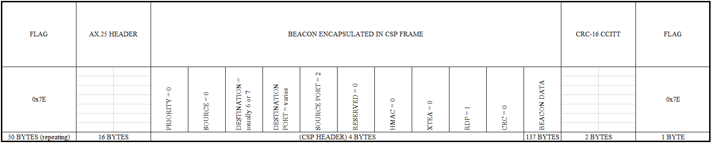
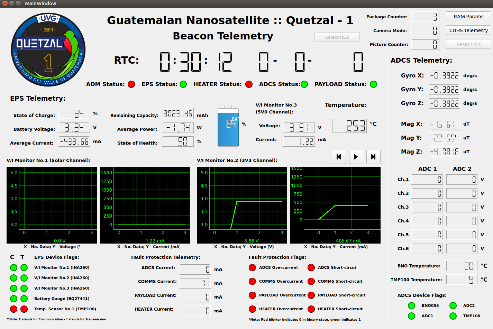

[En Español](https://github.com/danalvarez/gr-quetzal1/blob/master/README_es.md)

# gr-quetzal1

This repository contains the UHF specifications of Quetzal-1, the GNURadio decoder for the satellite and a Python application for data visualization. We also show a method of installing GNURadio 3.7 on Ubuntu 16.04 LTS, which is the software on which this code was tested.

1. [UHF Specifications](#user-content-uhf-specifications)
2. [Downlink Decoder and Parser](#user-content-downlink-decoder-and-parser)
	* [Live Frame Decoding](#user-content-live-frame-decoding)
		* [Doppler Correction](#user-content-doppler-correction)
	* [Post-mortem Frame Decoding](#user-content-post-mortem-frame-decoding)
		* [Example Beacon Recording](#user-content-example-beacon-recording)
3. [Python Scripts for Data Visualization ](#user-content-python-scripts-for-data-visualization)
	* [Post-mortem beacon parsing](#user-content-post-mortem-beacon-parsing)
	* [Live beacon parsing](#user-content-live-beacon-parsing)
4. [GNURadio 3.7 Installation](#user-content-gnuradio-37-installation)
	* [Install GNURadio 3.7 Dependencies](#user-content-install-gnuradio-37-dependencies)
	* [Install Python 2.7 modules for gr-satellites](#user-content-install-python-27-modules-for-gr-satellites)
	* [PyBOMBS](#user-content-pybombs)
	* [Install Recipe Files and GRURadio 3.7](#user-content-install-recipe-files-and-gnuradio-37)
	* [Installing gr-satellites](#user-content-installing-gr-satellites)
	* [Open the GNURadio GUI](#user-content-open-the-gnuradio-gui)
	* [Troubleshooting](#user-content-troubleshooting)

# UHF Specifications

## **Help us track Quetzal-1!**

Quetzal-1 is scheduled to be deployed from the Kibo module of the International Space Station on April 28, 2020 at 09:20 hours (GMT-6). About 30 minutes after ejection, it should deploy its antennas and begin beacon transmission. For downlink, Quetzal-1 uses a GOMSpace AX100 transceiver, which will transmit GMSK-modulated data at 4800 bps at 437.200 MHz ([as coordinated by IARU](http://www.amsatuk.me.uk/iaru/finished_detail.php?serialnum=653)).

Beacons will be encapsulated in AX.25 + HDLC frames, with G3RUH scrambling and NRZI encoding. The following image shows the overall beacon format:

The spacecraft’s beacon will be sent with a 10 second period. The spreadsheet in `docs/Beacon_Package_Data.xlsx` details both the AX.25 + HDLC structure and the beacon data format.

---
:warning: **NOTE**

Although it is always sent, we do not use the AX.25 portion of the packet. However, for the sake of being explicit, the data contained in the AX.25 section is always the following (in hexadecimal):

`40 40 40 40 40 40 60 40 40 40 40 40 40 61 03 F0`

---

# Downlink Decoder and Parser

[gr-satellites](https://github.com/daniestevez/gr-satellites) was used in this project to develop an AX.25 + HDLC decoder for data at 4800 bps. The flowgraph in `apps/ax25_decode.grc` can be opened via `gnuradio-companion`. If you installed GNURadio with PyBOMBS into a prefix (as shown in [section 4](#user-content-gnuradio-37-installation)), you can also run the decoder directly by executing:

	cd ~/prefix/default
	source ./setup_env.sh
	/usr/bin/python2 -u /home/dan/Documents/repos/gr-quetzal1/apps/ax25_decode.py

**When running the code above, be sure to replace the directory into which you've saved the decoder files.**

The decoder was designed with [live](#user-content-live-frame-decoding) and [post-mortem](#user-content-post-mortem-frame-decoding) decoding in mind. That is, frames from the satellite can be decoded and parsed live via the *UDP source*, or they can be post-processed via the *WAV File Source*.

## Live Frame Decoding

The live decoding feature works with GQRX and a compatible SDR. Locally, we use HackRF, but any SDR should work. In order to decode frames from the satellite, GQRX must first demodulate the incoming frames and then pass on this data into `ax25_decode.grc` via UDP.

In the GQRX main GUI, several things must be configured:

2. In the *Input Controls* tab:
	1. Ensure the *DC Remove* checkbox is checked.
	2. Adjust RF, IF and BB gains according to your needs. Common values that usually work on HackRF, depending on the noise around the antenna and the strength of the satellite signal are shown below. However, playing around with these values to find the optimal combination of gains is recommended.
		* RF: 0 dB, IF: 16 dB, BB: 20 to 32 dB
		* RF: 0 dB, IF: 24 dB, BB: 20 to 24 dB
		* RF: 14 dB, IF: 16 dB, BB: 20 to 24 dB
		* RF: 14 dB, IF: 8 dB, BB: 20 to 32 dB
3. In the *Receiver Options* tab:
	1. The satellite sends GMSK-modulated data. To demodulate such satellite signals, select Narrow FM as the demodulation mode.
	2. The filter width can be left to *Normal*, as this usually gives enough bandwidth for the 4800 bps frames from Quetzal-1.
4. In the *FFT Settings* tab:
	1. Set the FFT size to 32768. This usually makes the spectrum cleaner.
	2. You can adjust the zoom on the FFT display to fit your needs.
5. Make sure port 7355 is configured for UDP. To do so, click on the *...* button next to *Rec* and select the *Network* tab. Then configure:
	1. UDP Host: localhost
	2. UDP Port: 7355

Once you've correctly configured this (and making sure you're correctly tracking the downlink frequency for the satellite), connect GQRX with the decoder by clicking on the *UDP* button on the bottom right of the GQRX GUI. Run the decoder and, if all is correct, you should start to see decoded frames printed into the terminal.

These decoded frames are automatically saved into the `/home/user/Received Data` directory. The decoder saves both the parsed and raw data under the names `raw_beacon_X.dat` and `parsed_beacon_X.txt`, where `X` is the current datetime of your system.

---
:information_source: **NOTE**

`.dat` files can be opened with a Hex editor, such as [Bless Hex Editor](https://reposcope.com/application/bless-hex-editor).

---

### Doppler Correction

Doppler frequency correction can be achieved by connecting GPredict with GQRX. Guides on how to do this are readily available online, some examples [here](https://gqrx.dk/doc/remote-control) and [here](https://www.pe0sat.vgnet.nl/decoding/unix-tlm-decoding/).

## Post-mortem Frame Decoding

Frames can also be decoded once the satellite has passed, assuming you've saved a `.wav` file of the demodulated beacons. To record a pass, click on the *Rec* button next to *UDP* in the bottom right of GQRX. Then, go into the decoder and comment out the *UDP source* and *Short To Float* blocks. Afterwards, uncomment the *WAV File Source* and *Throttle* blocks, select the `.wav` file that you've recorded and run the flowgraph. Any correctly demodulated data should be decoded, parsed and saved into your home directory.

### Example Beacon Recording

We have provided a realistic recording of a satellite beacon in `recordings/example_beacon_quetzal1.wav`. If you decode this, you should obtain files equal to those shown in `examples/example_beacon_parsed.txt` and `examples/example_beacon_raw.dat`.

# Python Scripts for Data Visualization

Credit: Aldo Aguilar (aldostef@gmail.com)

---
:information_source: **NOTE**

As of commit `15ff8d9`, this GUI could only graph data "post-mortem". However, starting from commit `6565bdc`, the GUI can also show live beacons coming from the GNURadio decoder.

---

A GUI was developed in `python3` to visualize beacon data. For the program to run correctly, please make sure you've installed `PyQt5`, `pyqtgraph` 0.10.0 and `zmq`. To do so, run:

	python3 -m pip install PyQt5
	python3 -m pip install pyqtgraph==0.10.0
	python3 -m pip install zmq

Once this is done, you can run the script by going into the `apps/desktop/` directory, opening a terminal and running:

	python3 -m main.py

## Post-mortem Beacon Parsing

Upon opening the GUI, you can select a beacon to visualize by clicking on *Select Hex* and navigating to one of the decoded `.dat` files (for example, choose the file in `examples/example_beacon_raw.dat`). Once selected, the GUI will automatically start displaying beacons one second at a time. You can also scan through the beacons by clicking on the fast-foward and rewind buttons.

## Live Beacon Parsing

You can now view decoded data live by clicking on *Connect to port*, typing `localhost` as the IP address and `1502` as the port to connnect to. Once this is done, you can test it out by running the GNURadio decoder with the example beacon recording (`examples/example_beacon_quetzal1.wav`). Upon doing this, decoded frames will start to appear in the GUI. When tracking Quetzal-1, you can use this feature to view live data.

# GNURadio 3.7 Installation

The decoder was developed for GNURadio 3.7. We show below a process for installing this GNURadio version and other necessary modules in Ubuntu 16.04 LTS. We mainly use [PyBOMBS](https://github.com/gnuradio/pybombs) to install GNURadio.

## Install GNURadio 3.7 Dependencies

All the necessary dependencies can be installed by a single command, shown below. More info on this [here](https://wiki.gnuradio.org/index.php/UbuntuInstall).

	sudo apt-get -y install git-core cmake g++ python-dev swig \
	pkg-config libfftw3-dev libboost-all-dev libcppunit-dev libgsl0-dev \
	libusb-dev libsdl1.2-dev python-wxgtk3.0 python-numpy \
	python-cheetah python-lxml doxygen libxi-dev python-sip \
	libqt4-opengl-dev libqwt-dev libfontconfig1-dev libxrender-dev \
	python-sip python-sip-dev python-qt4 python-sphinx libusb-1.0-0-dev \
	libcomedi-dev libzmq-dev

## Install Python 2.7 Modules for gr-satellites

There are some Python modules necessary for gr-satellites, mainly `construct` and `requests`. To install, first install and update pip on Python 2.7.

	sudo apt-get install python-pip
	python2 -m pip install --upgrade pip

Then, install the aforementioned Python modules:

	python2 -m pip install construct[extras]
	python2 -m pip install requests

## PyBOMBS

PyBOMBS lets us install GNURadio easily (as well as any OOT modules we might want in the future). Install PyBOMBS through pip by running:

	python2 -m pip install pybombs

## Install Recipe Files and GNURadio 3.7

If it hasn't been created yet, create the prefix in which all GNURadio related files will be installed:

	mkdir prefix/

Then, install the necessary recipe files by running:

	pybombs recipes add gr-recipes git+https://github.com/gnuradio/gr-recipes.git
	pybombs recipes add gr-etcetera https://github.com/gnuradio/gr-etcetera.git

Finally, install GNURadio 3.7 with the following command. Note that if typing `gnuradio-default` instead of `gnuradio-stable` in the command, Pybombs will install GNURadio 3.8. For this guide, we do not want this.

	pybombs prefix init -a default prefix/default/ -R gnuradio-stable

## Installing gr-satellites

As of 2020, the master branch for gr-satellites has been updated to GNURadio 3.8. We must select GNURadio 3.7 for our installation. To do this, navigate to the recipe file, located in `~/.pybombs/recipes/gr-recipes/`. Search for the file `gr-satellites.lwr` and open it. Change the gitbranch parameter from `master` to `maint-3.7`. Save the file and run the commands below.

	cd prefix/default
	source ./setup_env.sh
	pybombs install gr-satellites
	cd src/gr-satellites/
	chmod +x ./compile_hierarchical.sh 
	./compile_hierarchical.sh

## Open the GNURadio GUI

Once this is all done, you may open the GUI for GNURadio by running:
 
	cd prefix/default
	source ./setup_env.sh
	gnuradio-companion

## Troubleshooting

1. There was a compatibility issue in the maint-3.7 branch of gr-satellites with construct v2.10 (see [this](https://github.com/daniestevez/gr-satellites/issues/84) link for more details). This issue was fixed in the v1.8.3 release of the maint-3.7 branch, so now construct v2.10 should work fine. If it happens again, maybe just roll back to construct v2.9 via the following commands:

        python2 -m pip uninstall construct[extras]
        python2 -m pip install construct[extras]==2.9.52

2. When installing PyBOMBS with pip in Python 2.7, we may get an error message saying that `setuptools` requires Python>=3.5. If this happens, roll back to a version of setuptools compatible with Python2, by running:

        python2 -m pip uninstall setuptools
        python2 -m pip install setuptools

	When running this, we rolled back from setuptools v46.X.X to v20.X.X and then the Pybombs installation went fine.

3. Ubuntu 16.04 LTS only normally updates `cmake` until version 3.5. If ever you are requested to have a newer version of `cmake`, you can do so by following these steps:

		sudo apt remove --purge --auto-remove cmake
		wget -qO - https://apt.kitware.com/keys/kitware-archive-latest.asc |
			sudo apt-key add -
		sudo apt-add-repository 'deb https://apt.kitware.com/ubuntu/ xenial main'
		sudo apt-get update
		sudo apt-get install cmake

	You can then check your `cmake` version by running:

		cmake --version

	This was taken from Liu Hao Cheng's answer in [this](https://stackoverflow.com/questions/49859457/how-to-reinstall-the-latest-cmake-version) Stackoverflow thread.